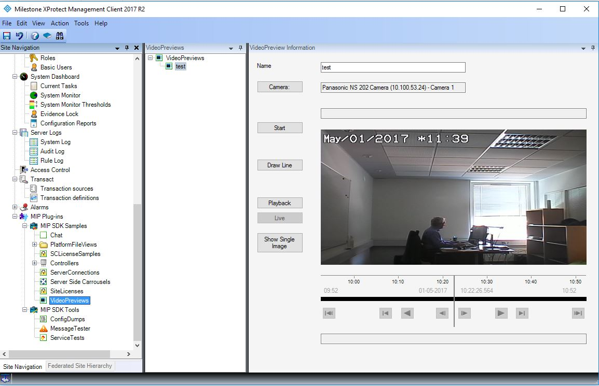

# Video Preview

The video preview sample demonstrates how to embed the
ImageViewerControl into your own UserControl on a Smart Client view or a
UserControl in Management Client.

The general idea is to provide a simple way of placing overlays or
configuring video position relevant parameters, for example, tripwire
analytics.

## MIP Environment - Smart Client

In this sample, you can place an overlay on top of live images.
When "Draw Line" is enabled, start by pushing the left mouse button, 
then drag it and release to finish the line.

Other features of the ImageViewerWpfControl are also demonstrated: 
Choose camera and stream, show time information, show header with 
camera name, digitally zoom etc.

Note: The sample uses WPF. This is also the general recommendations for 
Smart Client plug-ins.
ImageViewerControl uses WinForms and ImageViewerWpfControl uses WPF
but otherwise the two controls are very similar.

## MIP Environment - Management Client

This sample shows how to place a live video stream on a UserControl for
configuration purposes.

When you select a camera and click the Start button, the sample shows
live stream. Statistics are displayed at the bottom. The Draw Line
button is used for simple placement of a line. (The line itself is not
used for anything).

Use the Playback and Live buttons to stop or restart the live streaming.

## The sample demonstrates

- Selection of a single camera
- Placing an overlay on top of an ImageViewerControl initiated by the
  plug-in.
- How to redraw the overlay when changing the size of the control.
- How to get the last showed image as a .NET bitmap
- How to retrieve the LivePackage XML out of a live stream

## Using

- VideoOS.Platform.Client.ImageViewerWpfControl
- VideoOS.Platform.Admin.AdminImageViewerControl

## Environment

- Smart Client MIP Environment
- Management Client MIP Environments

## Visual Studio C\# project

- [VideoPreview.csproj](javascript:clone('https://github.com/milestonesys/mipsdk-samples-plugin','src/PluginSamples.sln');)
