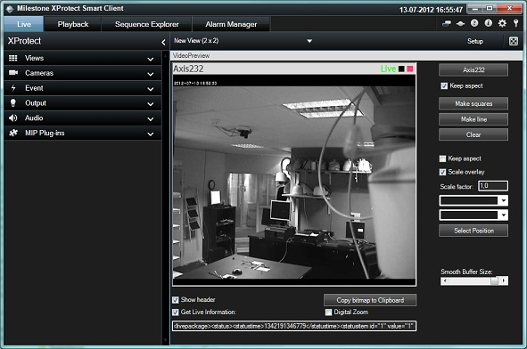

# Video Preview

The video preview sample demonstrates how to embed the
ImageViewerControl into your own UserControl on a Smart Client view or a
UserControl in Administrators.

The general idea is to provide a simple way of placing overlays or
configuring video position relevant parameters, for example, tripwire
analytics.

## MIP Environment - Smart Client

In this sample, you can place an overlay (either a square or a line) on
top of live images and define where this overlay should be placed.

The placement of an overlay can be different depending on the
application being implemented. For example, if you want the overlay to
scale together with the video image, or if you have some text on an
overlay and you want it to be placed in the upper left corner.

This sample has a few buttons and dropdowns to demonstrate the different
placement options.

## MIP Environment - Administrators

This sample shows how to place a live video stream on a UserControl for
configuration purposes.

When you select a camera and click the Start button, the sample shows
live stream. Statistics are displayed at the bottom. The Draw Line
button is used for simple placement of a line. (The line itself is not
used for anything).

Use the Playback and Live buttons to stop or restart the live streaming.

## The sample demonstrates

-   Selection of a single camera
-   Placing an overlay on top of an ImageViewerControl initiated by the
    plug-in.
-   Placement of the overlay
-   How to get the last showed image as a .NET bitmap
-   How to retrieve the LivePackage XML out of a live stream

## Using

-   VideoOS.Platform.Client.ImageViewerControl
-   VideoOS.Platform.Admin.AdminImageViewerControl

## Environment

-   Smart Client MIP Environment
-   Administrators MIP Environments

## Visual Studio C\# project

-   [VideoPreview.csproj](javascript:openLink('..\\\\PluginSamples\\\\VideoPreview\\\\VideoPreview.csproj');)
