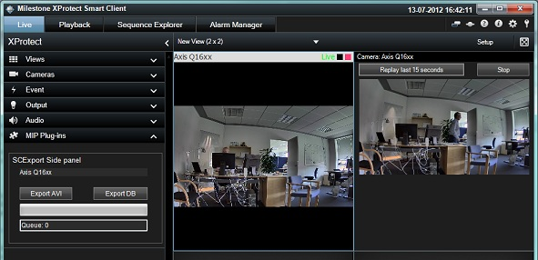
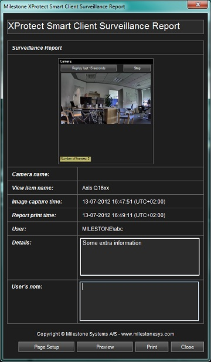

# Smart Client Video Replay

The video replay sample demonstrates how to get hold of a number of
video frames from the recorded database.

To setup, create a view, containing one camera and the plug-in sample.
When you select a camera and click the \"Replay last 15 seconds
button\", the plug-in asks the MIP Environment for a maximum of 150
frames starting 15 seconds before.

When received, it will place these in a .NET picture box, 5 times faster
than the original recording. The plug-in then waits 2 seconds and
replays the sequence again.

## The sample demonstrates

-   How to get hold of recorded images
-   Listen to currently selected camera in the Smart Client
-   How to understand when the Smart Client changes mode
-   How to make a simple print of currently displayed ViewItem

## Using

-   VideoOS.Platform.Data.JPEGVideoSource
-   VideoOS.Platform.Client.ViewItem.Print method

## Environment

-   Smart Client MIP Environment

## Visual Studio C\# project

-   [VideoReplay.csproj](javascript:openLink('..\\\\PluginSamples\\\\VideoReplay\\\\VideoReplay.csproj');)

## Special notes

The video frames received from the MIP environment have been transcoded
on the client PC to a set of JPEG images. When you click the Print
button in playback mode and you select the Video Replay sample, the
following dialog is displayed and ready for printing:

